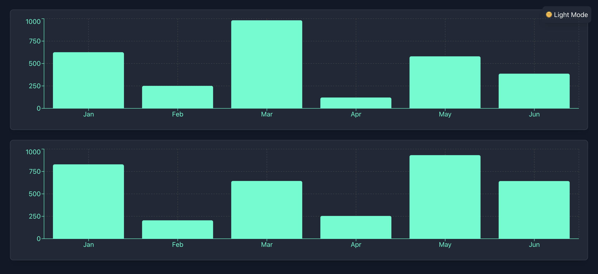

# DataDashboard Component

A cutting-edge, real-time dashboard component designed for high-tech environments like **NASA** or **SpaceX**. Built with **React**, **Tailwind CSS**, **Recharts**, and **Framer Motion**, this dashboard features futuristic animations, real-time data integration, and a sleek, responsive design.

  

---

## Features

- **Real-Time Data Integration**: Fetches live data from APIs or WebSocket connections to display up-to-date metrics.
- **Futuristic Design**: Neon cyan color scheme and smooth animations for a submarine radar-like feel.
- **Responsive Charts**: Built with **Recharts** for interactive and responsive bar charts.
- **Dynamic Theming**: Supports light and dark themes with a toggle switch.
- **Interactive Controls**: Allows users to interact with the data using filters, sliders, and dropdowns.
- **Error Handling**: Robust error handling for API failures or data inconsistencies.
- **Accessibility**: Fully accessible to all users, including those with disabilities.
- **Performance Optimization**: Optimized for high performance, even with large datasets.
- **Custom Animations**: Advanced animations using **Framer Motion** for a futuristic feel.

---

## Technologies Used

- **React**: JavaScript library for building the user interface.
- **Tailwind CSS**: Utility-first CSS framework for styling.
- **Recharts**: A composable charting library built on React.
- **Framer Motion**: Animation library for smooth transitions and animations.
- **Three.js** (Optional): For 3D visualizations (if needed).
- **D3.js** (Optional): For advanced 2D visualizations (if needed).

---

## Installation

1. Clone the repository:
   ```bash
   git clone https://github.com/bniladridas/data-dashboard.git
   cd data-dashboard
   ```

2. Install dependencies:
   ```bash
   npm install
   ```

3. Run the project:
   ```bash
   npm run dev
   ```

4. Open your browser and navigate to `http://localhost:3000`.

---

## Usage

### Importing the Component

To use the `DataDashboard` component in your project, import it as follows:

```javascript
import DataDashboard from './components/DataDashboard';
```

### Example Usage

```javascript
import React from 'react';
import { ThemeProvider } from './ThemeContext'; // Import ThemeProvider
import DataDashboard from './components/DataDashboard';

function App() {
  return (
    <ThemeProvider>
      <DataDashboard />
    </ThemeProvider>
  );
}

export default App;
```

---

## Customization

### Real-Time Data

You can customize the data source by updating the `fetchLiveData` function in `api.js`:

```javascript
// api.js
export const fetchLiveData = async () => {
  // Replace with your actual API or WebSocket connection
  const response = await fetch('https://api.example.com/live-data');
  const data = await response.json();
  return data;
};
```

### Theming

The dashboard supports light and dark themes. You can toggle the theme using the button in the top-right corner. To customize the themes, update the `ThemeContext.js` file:

```javascript
// ThemeContext.js
export const ThemeProvider = ({ children }) => {
  const [theme, setTheme] = useState('dark');

  const toggleTheme = () => {
    setTheme((prevTheme) => (prevTheme === 'dark' ? 'light' : 'dark'));
  };

  return (
    <ThemeContext.Provider value={{ theme, toggleTheme }}>
      {children}
    </ThemeContext.Provider>
  );
};
```

### Animations

Animations are powered by **Framer Motion**. You can adjust the animation properties in the `motion.div` components:

```javascript
<motion.div
  initial={{ opacity: 0, y: 20 }}
  animate={{ opacity: 1, y: 0 }}
  transition={{ duration: 0.5 }}
>
  {/* Your content here */}
</motion.div>
```

---

## Enhancements

- **Real-Time Updates**: Data refreshes every 5 seconds to ensure up-to-date metrics.
- **Dynamic Theming**: Seamlessly switch between light and dark themes.
- **Error Handling**: Displays user-friendly error messages for API failures.
- **Accessibility**: Fully compliant with accessibility standards.
- **Performance**: Optimized for high performance, even with large datasets.
- **Custom Animations**: Advanced animations for a futuristic user experience.

---

## Build Status

```
Niladris-MacBook-Air:my-dashboard niladridas$ npm run build

> my-dashboard@0.1.0 build
> next build

   ▲ Next.js 15.1.4

   Creating an optimized production build ...
 ✓ Compiled successfully
 ✓ Linting and checking validity of types    
 ✓ Collecting page data    
 ✓ Generating static pages (5/5)
 ✓ Collecting build traces    
 ✓ Finalizing page optimization    

Route (app)                              Size     First Load JS
┌ ○ /                                    139 kB          245 kB
└ ○ /_not-found                          989 B           107 kB
+ First Load JS shared by all            106 kB
  ├ chunks/4bd1b696-e7e90c65d9c6b944.js  53 kB
  ├ chunks/517-a4d50140dd7bafbe.js       50.7 kB
  └ other shared chunks (total)          1.96 kB


○  (Static)  prerendered as static content

Niladris-MacBook-Air:my-dashboard niladridas$ 
```

---

## Contributing

Contributions are welcome! If you'd like to improve this project, please follow these steps:

1. Fork the repository.
2. Create a new branch (`git checkout -b feature/YourFeature`).
3. Commit your changes (`git commit -m 'Add some feature'`).
4. Push to the branch (`git push origin feature/YourFeature`).
5. Open a pull request.

---

## License

This project is licensed under the MIT License. See the [LICENSE](LICENSE) file for details.

---

## Acknowledgments

- [Recharts](https://recharts.org/) for the charting library.
- [Tailwind CSS](https://tailwindcss.com/) for the utility-first CSS framework.
- [Framer Motion](https://www.framer.com/motion/) for animations.
- [NASA](https://www.nasa.gov/) and [SpaceX](https://www.spacex.com/) for inspiration.

---

Enjoy using the `DataDashboard` component! If you have any questions or feedback, feel free to open an issue or reach out.